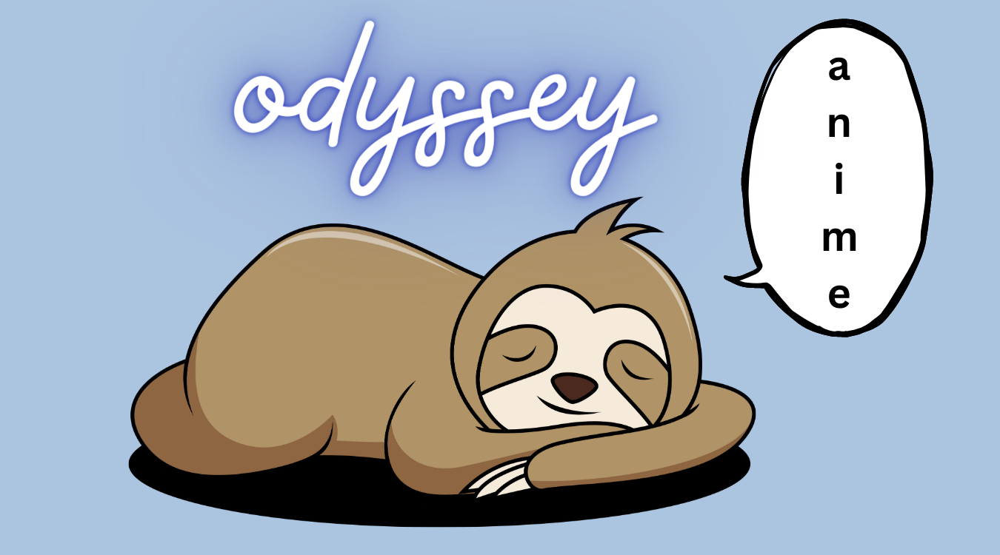

<!--  -->

  

  

## 🧐 What is Anime Odyssey?
**Anime Odyssey** is a community originally formed by a passionate otaku who shared his love for anime across various social media platforms. Over time, he recognized a common dilemma among his fellow members - the struggle to find new anime series or movies to watch after finishing their current favorites. To address this issue, he took a bold step and created an anime recommender system.

This system became a beacon of hope for anime enthusiasts who often found themselves at a loss for what to watch next. By utilizing his own experiences and preferences, **TECH TITAN** curated a collection of personalized recommendations for each user. Now, with just a few clicks, any otaku can receive tailored suggestions based on their favorite anime series or movies. Whether one enjoys action-packed shounen adventures or heartwarming slice-of-life tales, Anime Odyssey's recommendation engine ensures that no one feels lost in the vast sea of anime again.

In essence, Anime Odyssey serves as a gathering place where anime enthusiasts can connect, engage in discussions, and discover new shows to immerse themselves in. With its dedicated community and user-friendly recommender system, Anime Odyssey aims to enhance the anime-watching experience for otakus, ensuring that they always have an exciting anime adventure waiting just a click away.

## 🚀 Social Media Handles
<!--  -->

## ☎️ For any additional queries and suggestion contact at _[techtitanbot@gmail.com](mailto:techtitanbot@gmail.com)_
